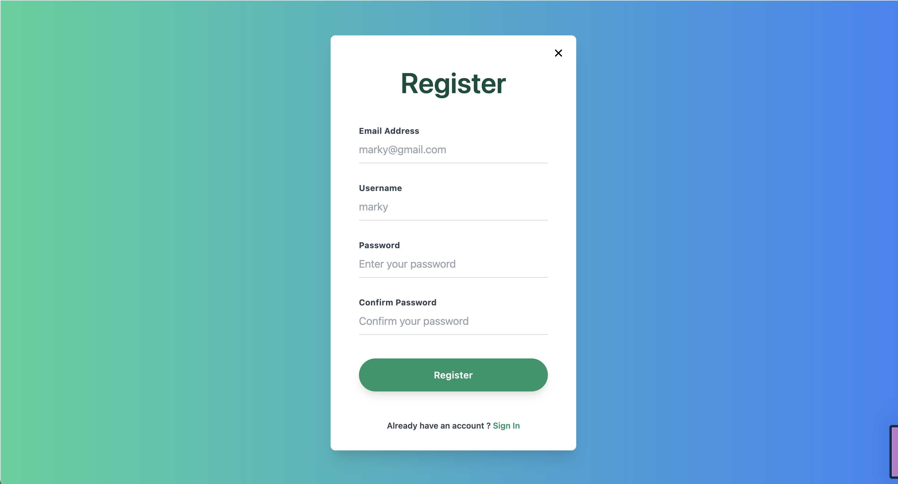
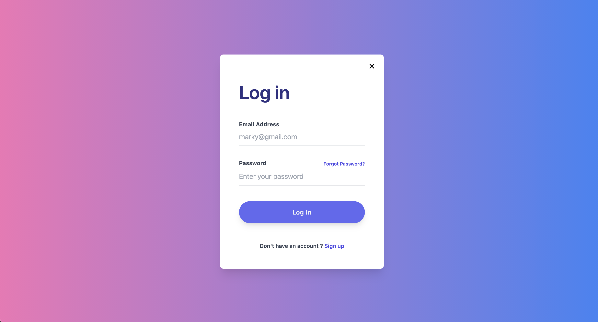
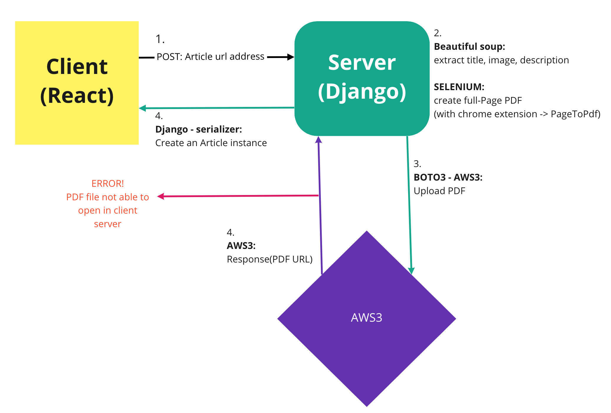
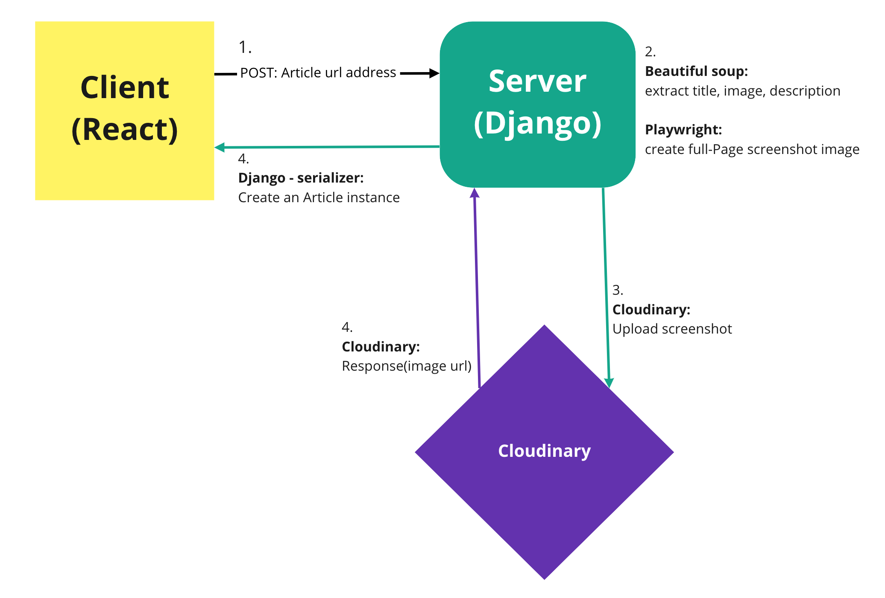

# Marky

A Book Mark web-application to collect URLs & write memo, built with Python, Django, ReactJS

[Marky - vercel](https://marky-react.vercel.app/)

[Marky-django with playwright github](https://github.com/HyunJungOh0120/marky-django2)

 

## ✍🏼 Description

Marky is a bookmark web application where user can easily and simply save their wanted URL. This web app provides the feature to create customized category in which articles can be archieved. On article page, user can see the screenshot of article and can write memo easily.

 

## 💻 Technologies

- Javascript
- React
  - React Query
- Python
- Playwright (Not applicable for deployment on Heroku, GCP)
- Django
- Django Rest Framework
- Simple JWT
- PostgreSQL
- Axios
- Tailwind CSS
- Cloudinary

 

## 🎨 Wireframes

User story

Landing page + Login/Logout page

Article board page

Aricle detail page

 
 

## 🎨 Visual

 
 

## 🛠 Process - Trials

#### 1. Selenium - AWS3

- First, I had a plan to add highlighting feature as well as memo on article detail page. Tried selenium with chrome extension (PageToPdf) and uploaded to aws3 using django-storages & boto3. However on Client side, pdf flie got 'access denied' . Selenium took too long time

 
 

#### 2. Playwright - Cloudinary

- Rather than selenium which needs chrome driver to be installed locally, Playwright also uses chrominium but it's much faster and light so I proceeded till the end of project. However, on Heroku and Google cloud, I got an error with 'ModuleNotFoundError: playwright' and couldn't deploy properly.
  Tried with heroku buildpack for playwright but it caused RunTimeError.

- Also tried pdfkit (python library) to create pdf, however this also needs local program 'wkhtmltopdf'

- On production: deployment, the feature to show pdf/screenshot of specific url address is removed. However, still leaving memo, sorting articles by creating categories are available.

 

## 📖 User Stories

1. User should be able to log in and authenticate on the website , as well as create an user account. Should be able to modify its own account info.

2. User can book mark easily by 'copy & paste' URL into bookmark form which is located in navation bar.

3. User can create customized categories under settled topics and add articles into specific category's binary.

4. User can see the screenshot which is populated when user put URL in article detail page. As well as user can write, edit, add and delete memo freely related to specific article.

 

### 📖 To Improve / Learn

1. Data types -> Bytes, Binary, Base64
2. AWS3 policy

## Author

- Hyun Jung Oh [GitHub Pages](https://github.com/HyunJungOh0120)
